# **MiWi™ Sniffer**

## **Introduction**

MiWi™ is a proprietary wireless protocol. MiWi uses small, low-power digital radios based on the IEEE 802.15.4 standard, and is designed for low-power, cost-constrained networks, such HVAC systems and alarm sensors where reliable self-healing mesh networking is needed. The MiWi protocol supports operation in the IEEE 802.15.4 radio PHY in the sub-GHz and 2.4 GHz ISM bands.

<!--- ## **The MiWi supports the following three network topologies:**
- Peer-to-Peer (P2P)
- Star
- Mesh

just --->
 - MiWi V6.xx is supported by SAMR30 and SAMR21 XPRO and Module boards. 
   * SAMR30 comprises AT86RF212B transceiver which can operate in Sub-GHZ frequency band.
   * SAMR21 comprises AT86RF233 transceiver which can operate in 2.4GHZ frequency band.	
 
 * The ZigBit USB sticks designed with the XMEGA® with AT86RF212B or AT86RF233 radio transceivers.

 * ZigBit devices shall serve as a protocol analyzer when used with the Wireshark sniffer firmware.
 
**NOTE: MiWi 5.x frame parsing and decoding is not supported with this MiWi Sniffer**
 
 
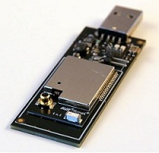

 
 <!--- --->

## **Requirements**

### **Hardware**
 
 - There are 2 types of Zigbit USB sticks which operates under different frequencies
    * 2.4GHz USB stick - [ATXMEGA256A3 AND AT86RF233 ZIGBIT USB STICK](https://www.microchip.com/en-us/development-tool/ATZB-X-233-USB)
    * Sub GHz USB stick - [ATXMEGA256A3U AND AT86RF212B ZIGBIT USB STICK](https://www.microchip.com/en-us/development-tool/ATZB-X-212B-USB)

   * To capture packets transmitted under 2.4GHZ frequency(Ex: SAMR21 Eval board for MiWi),  ATZB-X-233-USB ZIGBIT USB STICK (ATXMEGA256A3 and AT86RF233) can be used.
   * To capture packets transmitted under Sub-GHZ frequency(Ex: SAMR30 Eval board for MiWi), ATZB-X-212B-USB  ZIGBIT USB STICK (ATXMEGA256A3U and AT86RF212B) can be used.
  
 - [Atmel ICE](https://www.microchip.com/en-us/development-tool/ATATMEL-ICE)
   * Atmel-ICE is a powerful development tool for debugging and programming ARM® Cortex®-M based SAM and AVR microcontrollers with on-chip debug capability.
   * Used to Program Zigbit USB sticks with corresponding Sniffer Firmware via JTAG interface.

### **Software**

#### **MiWi Sniffer Software setup**
- Download & Install the following packages 

   - [Wireshark Sniffer Interface tool](./MiWi_Sniffer/wireshark_sniffer_interface_tool_v3.0.0.10.3.0.0.10.msi)
   - [MiWi Sniffer package for Mesh](./MiWi_Sniffer/Wireshark-win64-3.7.0miwi-mesh.exe) / [MiWi Sniffer package for P2P_Star](./MiWi_Sniffer/Wireshark-win64-3.7.0miwi-p2pstar.exe)

## **Installation & Capture Procedure**
### **Wireshark Sniffer Interface tool**

- Sniffer Interface tool need to be installed after a download from the above [section](#For-setting-up-miwi-Sniffer).
- Zigbit Sniffer USB needs to be upgraded with respective firmware (Firmware come along with Sniffer Interface tool package). 
- Please follow the instructions given under Section 3 of [ZigBit USB Stick User Guide](./MiWi_Sniffer/Atmel-42194-ZigBit-USB-Stick-User-Guide.pdf) for Sniffer Interface tool installation and Sniffer Firmware installation.

<!--- 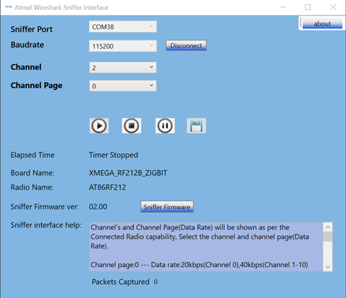--->

 
### **MiWi Sniffer Package Installation for Mesh and P2P_Star**

- After downloading the Wireshark-win64-3.7.0miwi-mesh.exe/Wireshark-win64-3.7.0miwi-p2pstar.exe, the package can be installed by following the instructions (Installation steps are similar for both MiWi Mesh and P2P_Star)

   - *NOTE: Please note that either MiWi Mesh or P2P_Star package can be installed separately at a time. While installing second package, the first one needs to be uninstalled.*

<!--- 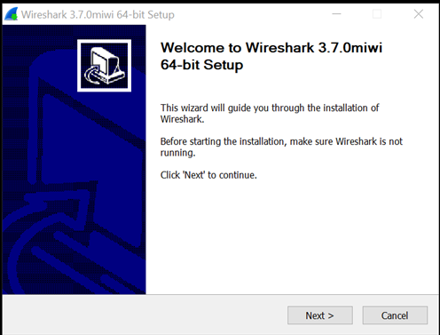--->

- Please make sure the path is C:\Wireshark (Since the default path during installation will be C:\Program Files\Wireshark which might lead to issues while capturing packets).

<!--- 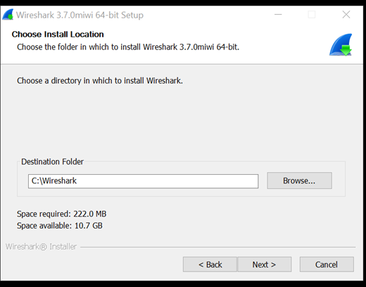

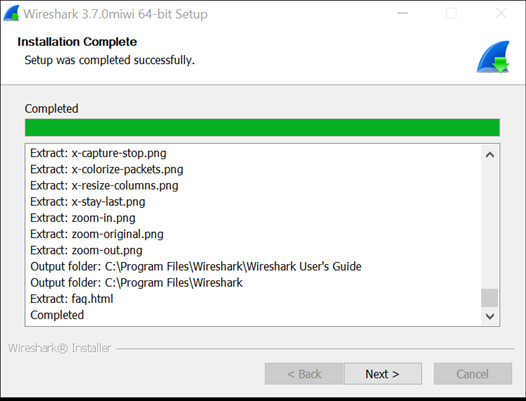

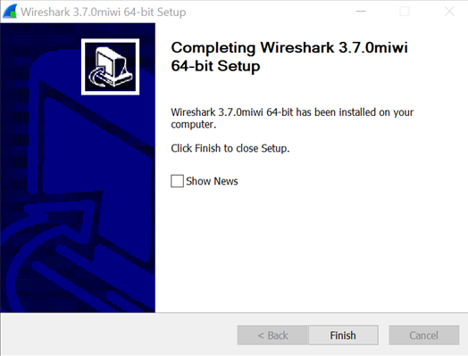--->

### **Steps to capture Mesh/P2P_Star Packets in Wireshark Protocol Network Analyzer**

- Launch the Wireshark Sniffer Interface tool and connect to Zigbit Sniffer by choosing the appropriate COM Port, Baud Rate, channel and Click on Start Button which will launch the Wireshark Network Protocol Analyser. 

- In the Wireshark Network Protocol Analyser, under the Menu Bar, navigate to Analyze->Enabled Protocols to enable the IEEE 802.15.4 and the respective application -specific protocol (MiWi Mesh/P2P star depending on the installed package) and click OK.

<!--- 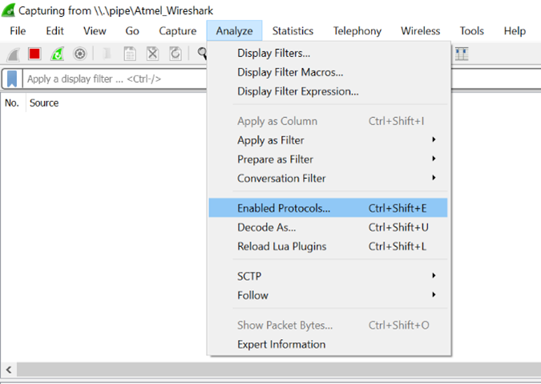--->

- IEEE 802.15.4 should be a mandatory selection for both Mesh and P2P_star

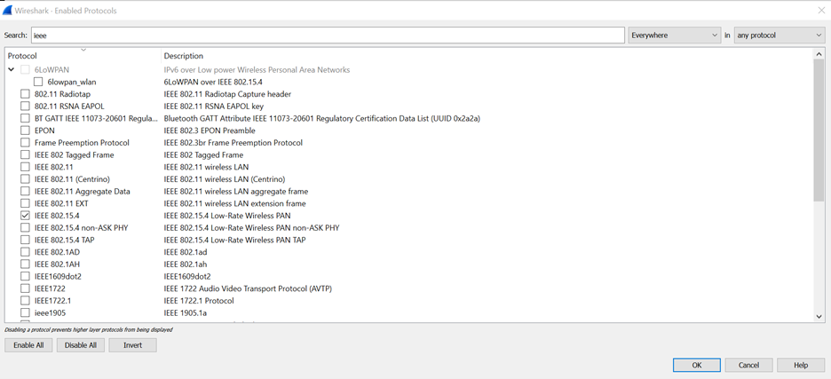

- MiWi Mesh 

<!--- 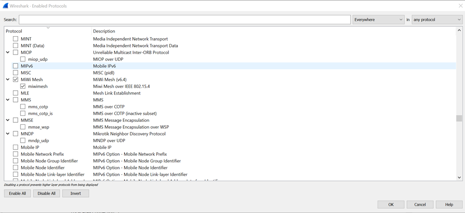

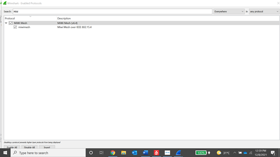--->

- MiWi P2P_Star

<!--- 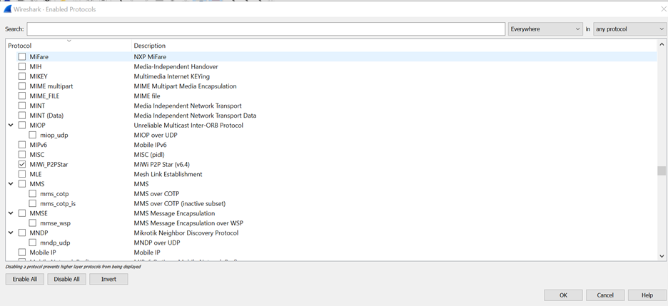--->

#### **Packet Captures for MiWi Mesh and P2P_Star**

<!--- 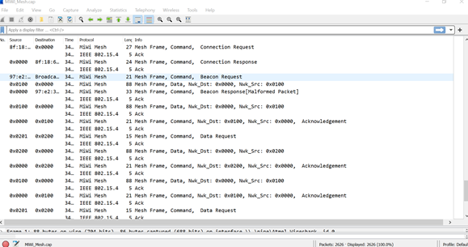--->

<!--- 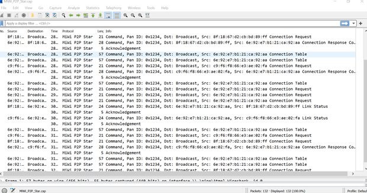--->

#### **Save Packet Capture**

* To Save the captured packets, press the Stop Capture button (Next to Start capture). A dialog box will open and ask if the captured packets need to be saved in PC. Select Yes to save the captured packet in preferred location with a custom name, then the file will be saved with .cap extension. It can be reopened using Wireshark Protocol Network Analyzer.

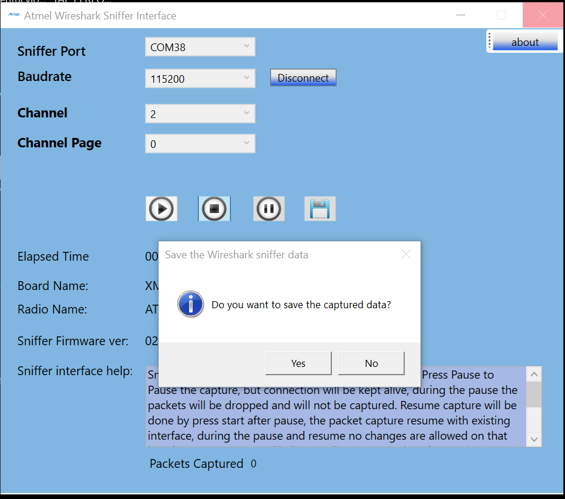

<!--- Please refer [MiWi Software Design Guide](http://ww1.microchip.com/downloads/en/DeviceDoc/MiWi-Software-Design-Guide-User-Guide-DS50002851A.pdf) for more details. 

Refer [MiWi Sniffer package](./MiWi_Sniffer/file.exe)--->
